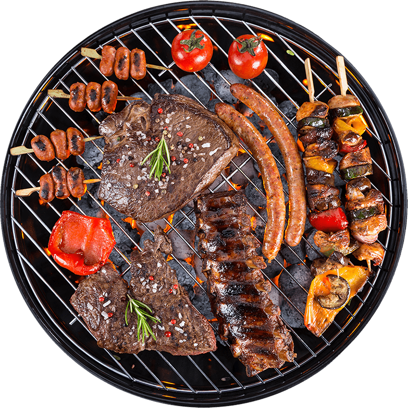

<p align="center">
  
</p>

<h1 align="center">🍽️ Geed Balaadh Restaurant</h1>

<p align="center">
  <strong>A full-stack restaurant management web application built with ASP.NET Core & SQL Server</strong>
</p>

<p align="center">
  <a href="#features">Features</a> •
  <a href="#tech-stack">Tech Stack</a> •
  <a href="#getting-started">Getting Started</a> •
  <a href="#api-endpoints">API Endpoints</a> •
  <a href="#database-schema">Database</a> •
  <a href="#screenshots">Screenshots</a> •
  <a href="#author">Author</a>
</p>

<p align="center">
  
  
  
  
  
</p>

---

## 📖 About

**Geed Balaadh** is a modern, full-stack restaurant web application that allows customers to browse the menu, place food orders, book tables, leave reviews, and track their deliveries — all from a beautiful, responsive interface. The backend is powered by **ASP.NET Core Web API** with **Entity Framework Core** connected to a **SQL Server** database.

> 📍 **Address:** Hargeisa, Xero-awr  
> 📞 **Phone:** 407596  
> 📧 **Email:** info@geedka.com

---

## ✨ Features

### 🔐 Authentication & User Accounts
- Full **Login** and **Register** pages with session persistence
- User profile dropdown in navbar after authentication
- Auth guards — unauthenticated users can browse freely but must log in to order, book, or review

### 🍔 Food Ordering System
- Dynamic menu loaded from the database with multiple restaurant tabs
- Shopping cart with quantity controls (+/-)
- Coupon / discount code system with real-time validation
- Multiple payment methods (Card, Cash on Delivery, Apple Pay)
- Order placement with automatic order tracking

### 📅 Table Reservations
- Interactive booking form with date/time picker
- Guest count selection
- Special request field
- Confirmation modal with reservation details

### ⭐ Customer Reviews
- Star rating system (1–5 stars)
- Review comments per restaurant
- Dynamic review cards rendered from the database

### 🚚 Order Tracking
- Real-time order status lookup by Order ID
- Full status timeline with progress history
- Detailed order breakdown (items, quantities, totals)

### 🎨 Beautiful UI/UX & Fancy Features
- Modern dark theme with premium design system
- **Shimmer Text Logo Effect**: Multi-tone gold-to-white animated shimmer branding (`brand-text-shimmer`)
- **Floating Quick-Cart Button**: Fixed bottom-right quick action button with live item badge counter
- **Glassmorphism Cards**: Translucent card backdrops with gold border glow on hover (`fancy-glass-card`)
- **Custom Scrollbar**: Sleek orange/gold gradient custom scrollbar track
- Smooth animations and transitions (WOW.js & animate.css)
- Fully responsive layout — tailored for mobile, tablet, and desktop viewports
- Interactive toast notifications for real-time order and reservation feedback

---

## 🛠️ Tech Stack

| Layer | Technology |
|-------|-----------|
| **Backend** | ASP.NET Core 10.0 Web API |
| **ORM** | Entity Framework Core |
| **Database** | Microsoft SQL Server |
| **Frontend** | HTML5, CSS3, JavaScript (ES6+) |
| **CSS Framework** | Bootstrap 5.3 |
| **JS Libraries** | jQuery 3.7, WOW.js, Waypoints |
| **Icons** | Font Awesome 6 |
| **Architecture** | RESTful API + Static Frontend |

---

## 🚀 Getting Started

### Prerequisites

- [.NET 10 SDK](https://dotnet.microsoft.com/download) or later
- [SQL Server](https://www.microsoft.com/en-us/sql-server) (Express edition works fine)
- Git

### Installation

1. **Clone the repository**
   ```bash
   git clone https://github.com/abdifatah-com/Geed-Balaadh-Resturant-.git
   cd Geed-Balaadh-Resturant-
   ```

2. **Configure the database connection**
   
   Update the connection string in `appsettings.json` to match your SQL Server instance:
   ```json
   {
     "ConnectionStrings": {
       "DefaultConnection": "Server=YOUR_SERVER;Database=Dalabat;Trusted_Connection=True;TrustServerCertificate=True"
     }
   }
   ```

3. **Build the project**
   ```bash
   dotnet build
   ```

4. **Run the application**
   ```bash
   dotnet run --urls "http://localhost:5000"
   ```

5. **Open in your browser**
   ```
   http://localhost:5000
   ```

> 💡 The database tables and seed data are automatically created on first run via `DbInitializer.cs`.

---

## 📡 API Endpoints

### Users & Authentication
| Method | Endpoint | Description |
|--------|----------|-------------|
| `GET` | `/api/users` | List all users |
| `GET` | `/api/users/{id}` | Get user by ID |
| `POST` | `/api/users/register` | Register a new account |
| `POST` | `/api/users/login` | Login with email & password |

### Restaurants & Menu
| Method | Endpoint | Description |
|--------|----------|-------------|
| `GET` | `/api/restaurants` | List all restaurants with menu items |
| `GET` | `/api/restaurants/{id}` | Get restaurant details |
| `GET` | `/api/fooditems` | List all food items |

### Orders
| Method | Endpoint | Description |
|--------|----------|-------------|
| `GET` | `/api/orders` | List all orders |
| `GET` | `/api/orders/{id}` | Get order with items & progress |
| `POST` | `/api/orders` | Place a new order |

### Reservations
| Method | Endpoint | Description |
|--------|----------|-------------|
| `GET` | `/api/reservations` | List all reservations |
| `POST` | `/api/reservations` | Book a table |

### Reviews
| Method | Endpoint | Description |
|--------|----------|-------------|
| `GET` | `/api/reviews` | List all reviews |
| `POST` | `/api/reviews` | Submit a review |

### Coupons
| Method | Endpoint | Description |
|--------|----------|-------------|
| `GET` | `/api/coupons` | List all coupons |
| `GET` | `/api/coupons/validate/{code}` | Validate a coupon code |

---

## 🗃️ Database Schema

The application uses **9 core tables** in SQL Server:

```
┌──────────────┐     ┌──────────────┐     ┌──────────────┐
│    Users     │     │ Restaurants  │     │  Categories  │
├──────────────┤     ├──────────────┤     ├──────────────┤
│ UserID (PK)  │     │ RestID (PK)  │     │ CatID (PK)   │
│ Name         │     │ Name         │     │ Name         │
│ Email        │     │ Address      │     │ Description  │
│ PasswordHash │     │ Phone        │     └──────────────┘
│ Phone        │     │ Rating       │
│ Address      │     └──────────────┘
└──────────────┘

┌──────────────┐     ┌──────────────┐     ┌──────────────┐
│  FoodItems   │     │   Orders     │     │ OrderItems   │
├──────────────┤     ├──────────────┤     ├──────────────┤
│ FoodID (PK)  │     │ OrderID (PK) │     │ ItemID (PK)  │
│ RestID (FK)  │     │ UserID (FK)  │     │ OrderID (FK) │
│ CatID (FK)   │     │ RestID (FK)  │     │ FoodID (FK)  │
│ Name         │     │ TotalAmount  │     │ Quantity     │
│ Price        │     │ Status       │     │ Price        │
│ Description  │     │ PaymentStatus│     └──────────────┘
└──────────────┘     └──────────────┘

┌──────────────┐     ┌──────────────┐     ┌──────────────┐
│ Reservations │     │   Reviews    │     │   Coupons    │
├──────────────┤     ├──────────────┤     ├──────────────┤
│ ResID (PK)   │     │ ReviewID(PK) │     │ CouponID(PK) │
│ UserID (FK)  │     │ UserID (FK)  │     │ Code         │
│ RestID (FK)  │     │ RestID (FK)  │     │ Discount %   │
│ GuestCount   │     │ Rating       │     │ MaxDiscount  │
│ DateTime     │     │ Comment      │     │ ExpiryDate   │
│ Status       │     │ CreatedAt    │     │ IsActive     │
└──────────────┘     └──────────────┘     └──────────────┘
```

### Seed Data Includes:
- **3 Restaurants**: Burger Central, Pizza Supreme, Al Sultan Shawarma
- **20+ Food Items** across Burgers, Pizza, Middle Eastern, and Beverages
- **3 Coupons**: `DALABAT20`, `WELCOME10`, `SAVE15`
- **3 Sample Users** for testing
- **Sample Reviews** and **Orders**

---

## 📁 Project Structure

```
Geed-Balaadh-Resturant-/
├── Controllers/           # API Controllers (Users, Orders, Reviews, etc.)
├── Data/                  # DbContext & Database Initializer
├── DTOs/                  # Data Transfer Objects
├── Models/                # Entity Models
├── Migrations/            # EF Core Migrations
├── Properties/            # Launch settings
├── css/                   # Stylesheets
├── js/
│   └── dalabat-api.js     # Frontend API integration & auth logic
├── img/                   # Images and assets
├── lib/                   # Third-party JS libraries
├── Restoran/              # Alternative template directory
├── index.html             # Homepage
├── about.html             # About page
├── menu.html              # Menu page
├── booking.html           # Table reservation page
├── contact.html           # Contact page
├── team.html              # Team page
├── login.html             # Login page
├── register.html          # Registration page
├── Program.cs             # App entry point & middleware
├── appsettings.json       # Configuration
└── dalabat.csproj         # Project file
```

---

## 🧪 Test Credentials

You can use the following credentials to test the application:

| Email | Password | Role |
|-------|----------|------|
| `ahmed.user@gmail.com` | `Password123!` | Customer |
| `admin@dalabat.com` | `Password123!` | Admin |

Or create a new account via the **Register** page!

---

## 🎨 Pages Overview

| Page | Description |
|------|-------------|
| **Home** | Hero section, about preview, menu highlights, reviews |
| **About** | Restaurant story, team stats, experience counters |
| **Menu** | Tabbed menu by restaurant with "Add to Cart" buttons |
| **Booking** | Table reservation form with date/time and guest count |
| **Contact** | Contact form, Google Maps embed, address details |
| **Team** | Chef and staff profiles |
| **Login** | User authentication page |
| **Register** | New account registration page |

---

## 👨‍💻 Author

**Abdifatah Faisal**

- 📧 Email: info@geedka.com
- 📍 Location: Hargeisa, Xero-awr
- 🐙 GitHub: [@abdifatah-com](https://github.com/abdifatah-com)

---

## 📄 License

This project is open source and available for educational and personal use.

---

<p align="center">
  Made with ❤️ in Hargeisa, Somalia
</p>
